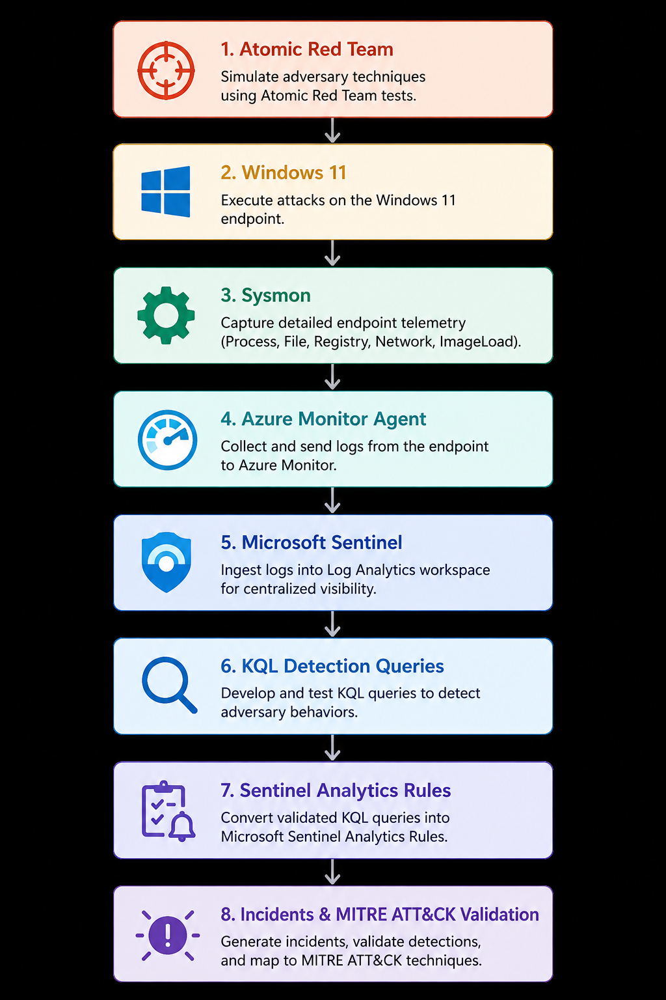

# Microsoft Sentinel MITRE ATT&CK Purple Team Detection Pipeline Project

Purple team detection engineering project using Atomic Red Team, Sysmon and Microsoft Sentinel to simulate MITRE ATT&CK techniques and validate endpoint detections.

## Architecture

  

## Detection Workflow

1. Simulate adversary techniques using Atomic Red Team.
2. Capture endpoint telemetry with Sysmon.
3. Ingest endpoint telemetry into Microsoft Sentinel.
4. Develop KQL detection queries.
5. Validate detections against generated telemetry.
6. Create Microsoft Sentinel Analytics Rules.
7. Validate alerts and incidents generated by the detections.
8. Map detections to MITRE ATT&CK techniques.

## Overview

This project demonstrates an end-to-end purple team detection engineering workflow using Atomic Red Team, Sysmon, and Microsoft Sentinel. MITRE ATT&CK techniques were executed on a Windows endpoint to simulate adversary behaviour, while Sysmon captured endpoint telemetry that was ingested into Microsoft Sentinel for analysis.

Custom KQL detection queries were developed and validated against the generated Sysmon telemetry to detect simulated adversary activity. Validated detections were then implemented as Microsoft Sentinel Analytics Rules and tested to confirm that simulated adversary behaviour generated the expected alerts and incidents.

Each detection was mapped to the corresponding MITRE ATT&CK technique, demonstrating how adversary emulation can be used to improve defensive visibility and detection capabilities.

## Why I Built This

The purpose of this project was to build on practical detection engineering experience by developing and validating endpoint detections within Microsoft Sentinel.

Rather than only studying MITRE ATT&CK techniques, I wanted to simulate attacker behaviour, understand the telemetry produced on a Windows endpoint, develop KQL detections, and operationalize those detections as Microsoft Sentinel Analytics Rules.

This project demonstrates the complete detection engineering lifecycle from adversary simulation and telemetry collection to detection development, validation, alert generation, and MITRE ATT&CK mapping.

## MITRE ATT&CK Coverage

| Technique | Description |
|-----------|-------------|
| [T1574.001 – DLL Search Order Hijacking](T1574.001-DLL-Search-Order-Hijacking.md) | DLL Search Order Hijacking |
| [T1105 – Ingress Tool Transfer](T1105-Ingress-Tool-Transfer.md) | Ingress Tool Transfer |
| [T1059.001 – PowerShell](T1059.001-PowerShell.md) | Command and Scripting Interpreter: PowerShell |
| [T1547.001 – Registry Run Keys / Startup Folder](T1547.001-Registry-Run-Keys.md) | Registry Run Keys / Startup Folder |
| [T1105 + T1547.001 – Correlation](T1105-T1547.001-Correlation.md) | Correlated Ingress Tool Transfer and Registry Run Key Persistence |
| [T1070.004 – File Deletion](T1070.004-Suspicious-File-Deletion.md) | Indicator Removal: File Deletion |

## Skills Demonstrated

- Detection Engineering
- Purple Team Methodology
- MITRE ATT&CK Mapping
- Microsoft Sentinel (KQL)
- Microsoft Sentinel Analytics Rules
- Sysmon Configuration & Telemetry Analysis
- Atomic Red Team Adversary Simulation
- Windows Endpoint Monitoring
- Log Analysis & Event Correlation
- Detection Validation
- Security Incident Validation

## Lessons Learned

- Built and validated KQL detections using Sysmon endpoint telemetry.
- Learned to manually extract and parse Sysmon XML fields within Microsoft Sentinel when required fields were not directly exposed as columns.
- Learned how Sysmon Event ID 7 provides visibility into DLL image loading and how `Image` and `ImageLoaded` can be used to identify suspicious DLL loading behaviour.
- Validated DLL Search Order Hijacking by detecting a DLL loaded from a non-standard user-controlled path.
- Learned that broad Event ID 7 detections generate significant telemetry and require behavioural filtering to reduce noise.
- Developed correlated detections using multiple attacker behaviours rather than relying solely on individual events.
- Converted validated KQL queries into Microsoft Sentinel Analytics Rules and confirmed detection through generated incidents.
- Validated detections against generated adversary telemetry rather than relying solely on query results.
- Improved understanding of Windows process execution, file activity, registry persistence, DLL loading, and MITRE ATT&CK mapping.

## References

Additional references and documentation used throughout this project are available in [References.md](References.md).
